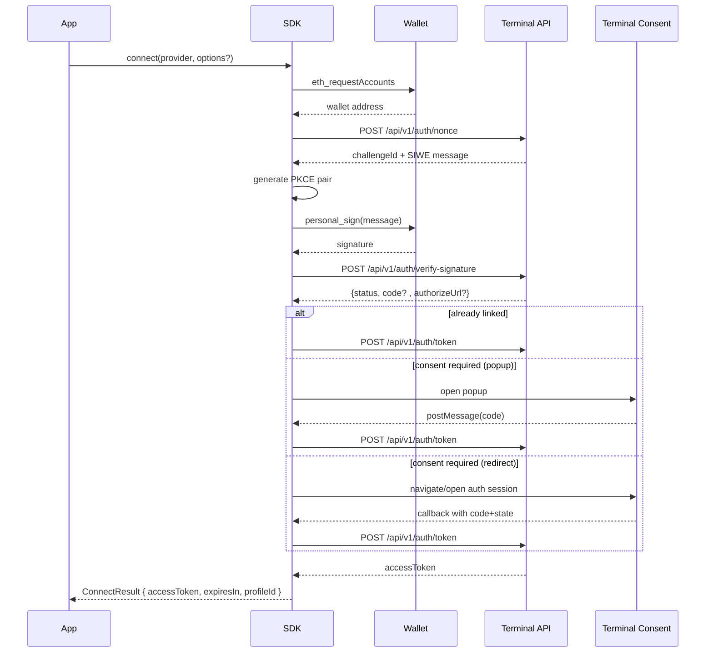

# Authentication Flow

The SDK uses SIWE-style wallet signatures + PKCE to complete an OAuth-style auth flow.

## Overview

## Step-by-step

### 1. Wallet address

The SDK requests wallet accounts through EIP-1193 (`eth_requestAccounts`).

### 2. Nonce + SIWE message

The SDK calls `/api/v1/auth/nonce` with `{ wallet, clientId }`.

### 3. PKCE generation

A random `codeVerifier` and `codeChallenge` are generated.

### 4. Signature

The wallet signs the SIWE message (`personal_sign`).

### 5. Signature verification

The SDK posts signature + PKCE challenge to `/api/v1/auth/verify-signature`.

Possible responses:

- `status: "linked"` + `code`: wallet already linked; no consent step needed.
- `authorizeUrl`: consent is required.

### 6. Consent step (popup or redirect)

- **Popup (web default):** opens consent in a popup and waits for `postMessage` callback.
- **Redirect (web):** stores PKCE/state in ephemeral storage, navigates away, then resumes on callback via `handleRedirectCallback()`. The callback route itself does not need custom logic beyond normal app bootstrap. On callback, SDK removes OAuth params (`code`, `state`) from the URL.
- **Redirect (Expo):** opens auth session (`expo-web-browser`) and receives callback URL in-process.

### 7. Token exchange

The SDK exchanges `{ code, codeVerifier, clientId }` at `/api/v1/auth/token`.

### 8. Session persistence

On success, SDK stores session data (access token, profile ID, expiry, wallet address) through the active platform adapter:

- Web default adapter: `localStorage`
- Expo adapter: `expo-secure-store` (unless an explicit custom storage backend is provided)

### 9. Session restoration

`restoreSession(provider?)` restores a valid stored session and can optionally validate wallet identity against `eth_accounts` when a provider is passed.

### 10. Account change handling

After connect, SDK subscribes to `accountsChanged`. If wallet account changes, it clears session and transitions to `disconnected`.

## Error behavior

If any step fails, SDK clears session state, emits `error`, and rejects the current call.

## Related

- [Authentication Types](./authentication-types.md)
- [TerminalClient API](../api-reference/terminal-client.md)
