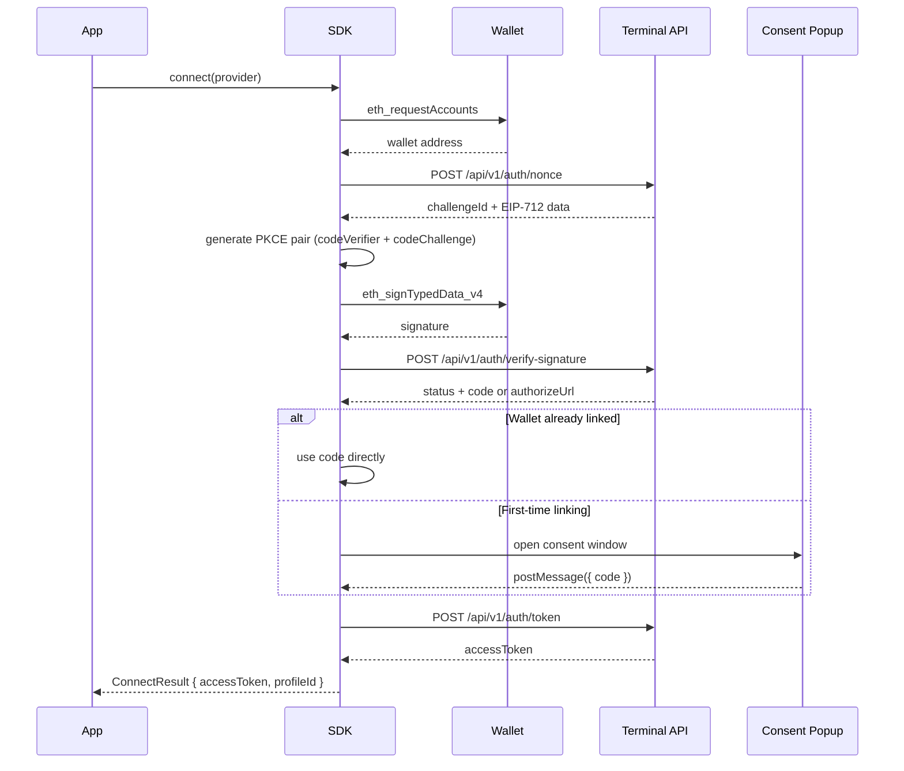

# Authentication Flow

The SDK uses an OAuth-style flow secured by wallet signatures (EIP-712) and PKCE. This page explains each step so you understand what happens when `connect()` is called.

## Overview

## Step-by-step

### 1. Request wallet address

The SDK calls `eth_requestAccounts` on the EIP-1193 provider. The wallet prompts the user to select an account. The returned address is used for all subsequent requests.

### 2. Request a nonce

The SDK sends a `POST` to `/api/v1/auth/nonce` with the wallet address and `clientId`. The API returns:

- `challengeId` — a unique ID for this auth attempt
- `eip712Data` — typed data for the wallet to sign, following the [EIP-712 standard](https://eips.ethereum.org/EIPS/eip-712)

### 3. Generate a PKCE pair

The SDK generates a cryptographically random `codeVerifier` (128 characters) and its SHA-256 base64url-encoded `codeChallenge`. This is the standard [PKCE](https://datatracker.ietf.org/doc/html/rfc7636) mechanism — the `codeChallenge` is sent to the server now, and the `codeVerifier` is only revealed when exchanging the code for a token. This prevents authorization code interception attacks.

### 4. Sign the challenge

The SDK calls `eth_signTypedData_v4` on the provider with the EIP-712 data. The wallet shows the user a structured signing prompt. The resulting signature proves ownership of the wallet address.

### 5. Verify the signature

The SDK sends the `challengeId`, `signature`, and `codeChallenge` to `/api/v1/auth/verify-signature`. The API verifies the signature on-chain and returns one of two responses:

- **`status: "linked"` with a `code`** — the wallet is already linked to a Terminal profile. The auth code is returned directly.
- **`authorizeUrl`** — the wallet is not yet linked. A consent URL is returned.

### 6. Consent popup (first-time only)

If the wallet is not linked, the SDK opens the `authorizeUrl` in a 500×600px popup window. The popup is hosted by Terminal and walks the user through linking their Terminal account. When the user approves, the popup sends a `postMessage` back to the opener with `{ code }` and closes itself.

The SDK listens for this message and validates that it came from the expected origin (`terminal.megaeth.com` by default). If the user closes the popup manually, the flow times out after 2 minutes and throws an error.

### 7. Token exchange

The SDK sends the `code` and `codeVerifier` to `/api/v1/auth/token`. The API verifies that the `codeVerifier` hashes to the `codeChallenge` sent in step 5, then returns an `accessToken`.

### 8. Account change detection

After a successful connect, the SDK subscribes to the `accountsChanged` event on the provider. If the user switches wallets, the SDK automatically disconnects and emits a `stateChange: disconnected` event.

## Error handling

If any step fails, the SDK:

1. Clears the access token and connected address
2. Emits an `error` event
3. Throws the error so the calling code can handle it

All errors from the API include the HTTP status code in the message (e.g. `API error 401: ...`).
